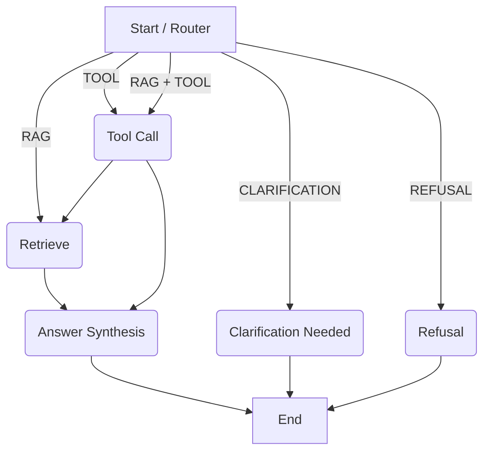

# Implementation Notes: AI-Powered University Student Services Assistant

## 1. What was implemented
A FastAPI backend serving as the orchestration layer using LangGraph. It is designed to act as the boundary where teammates can plug in their implementations for RAG, Data, and deterministic tools.

## 2. API Contract
- `POST /ask`: Accepts student queries, routing them to the correct workflow (RAG, Tools, Refusal, etc.). Requires `X-Student-Id` header.
- `POST /ingest`: Supports live document ingestion with metadata.
- `GET /health`: Basic health readiness probe.
- `GET /sources`: Exposes the source register of ingested documents.
- `GET /audit/{trace_id}`: Retrieves the operational trace of a request.

## 3. LangGraph Workflow Diagram

## 4. RAG vs Tool Routing Logic
- Handled primarily in `app/graph/routing.py`.
- Deterministic heuristics route known intents (e.g., "my attendance") to `TOOL`.
- Questions about "policy" or "rules" go to `RAG`.
- Fallback uses an LLM structured output to decide the route.

## 5. Student Privacy / Authentication Approach
- Extracted purely from the `X-Student-Id` header in FastAPI.
- A deterministic check blocks queries that contain explicit other student IDs (e.g., S1002) when they shouldn't access them.

## 6. Audit Design
- An in-memory `AuditService` creates a trace at the start of `/ask` and updates it as LangGraph progresses.
- It records latency, route selected, tools invoked, and sources retrieved without exposing raw prompt chain-of-thought.

## 7. Source Register Design
- An interface `SourceRegisterServiceInterface` is provided. The mock holds an in-memory list of `SourceMetadata` returned via `/sources`.

## 8. Live Ingestion Interface
- `DocumentIngestionServiceInterface` accepts a binary file and JSON metadata.
- `POST /ingest` endpoint processes this without restarting the application.

## 9. Ollama Configuration
- Supported via `app/core/config.py` using `OLLAMA_BASE_URL` and `OLLAMA_MODEL`. Can be disabled with `MOCK_LLM=true`.

## 10. Mock Interfaces
- Defined in `app/interfaces/` and implemented in `app/services/mock_services.py`.
- Includes `MockRAGService`, `MockToolRegistry`, `MockStudentRepository`, etc.

## 11. Integration Points for Teammates
- **RAG Team**: Implement `RAGServiceInterface` and replace `MockRAGService`.
- **Tools Team**: Implement `ToolRegistryInterface` and plug into LangGraph node.
- **Data Team**: Implement `StudentRepositoryInterface`.

## 12. Known Limitations
- The mock router is very heuristic-based for testing; a production router will rely heavily on the LLM if heuristics miss.
- In-memory data will reset upon restart.

## 13. How to run locally
1. `python -m venv venv`
2. `venv\Scripts\activate`
3. `pip install fastapi uvicorn pydantic pydantic-settings langgraph httpx python-multipart`
4. `uvicorn app.main:app --reload`

## 14. How to test each endpoint
- `GET /health` in browser.
- `POST /ask` via cURL or Swagger UI (`http://localhost:8000/docs`).
- Run `pytest` to execute test suite.
